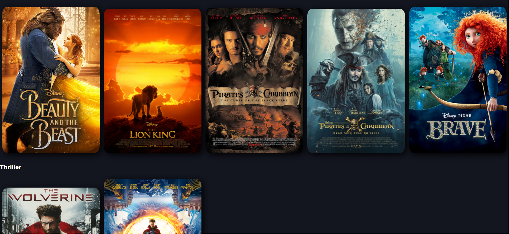
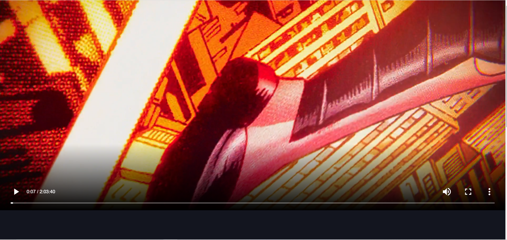

# disney-plus-clone

This project was extremely difficult. It didn't work correctly for a very long time. I did it because I wanted to worjk with GraphCMS. I like GraphCMS and I will be working with it again in the future.

## Environment Setup

1. Clone my repo at https://github.com/davidmstanleyjr/disney-plus-clone
2. CD into it and run "npm install".
3. Then type "npm run dev" to start the server.
4. You will have to setup GraphCMS on your own.

## Technologies Used

1. React
2. Next JS
3. GraphCMS
4. Graphql
5. Graphql-request

## Issues

I think  main issue is that I've never used GraphQL or GraphCMS before, so I had no frame of reference and didn't know what I was doing. 

GraphCMS reminds me a lot of Strapi. They both allow you to basically create your own API and consume it within your app. 

This project allows you to create an account with GraphCMS, attach a username and avatar to said account and consume it within your app. 

I could play videos but everything relating to the account simply wouldn't work. I'm talking about the username and avatar. I kept getting this error message in my terminal and in my console that the account username and avatar were both null. Basically, that information wasn't being read in the browser. 

Eventually, I figured out what I was doing wrong. In order to access my account information within the app, I needed to pass in my randomly generated account key that it attached to my account. I made a mistake and was passing in my platform ID instead of my account ID. I fixed the mistake and everything worked. 

GraphCMS is pretty user friendly and made playing videos pretty easy. I didn't have to write any video player logic. GraphCMS has it's own videoplayer and it works perfectly. 

The most difficult part was the changetoseen logic. I basically made each video unseen from the start and it would change to seen if someone clicked on it. I basically used a boolean to make that work.

# Screenshots

